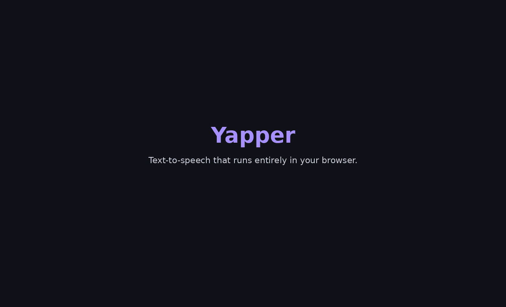

# Yapper 🔊

**Browser text-to-speech with zero cloud.** Kokoro, Kitten, and SpeechT5 run entirely in your browser. No cloud processing. No data sent anywhere. Models load once, then everything runs locally on your device via WebGPU (or WASM fallback).

> **Note on performance:** inference currently runs on the main thread, so long generations will block the page while a job is in progress. A Web Worker build is in progress to fix this — see [issue tracker](https://github.com/phantomic12/yapper/issues). The non-blocking queue still lets you stack multiple jobs; only the active one blocks.

## Quick start

1. Open the [live demo](https://phantomic12.github.io/yapper/) (or run `npm run dev` locally).
2. Pick a model:
   - **Kokoro-82M (q8f16)** — best quality, 6 built-in English voices, ~86 MB download
   - **Kitten TTS Mini** — balanced quality, 8 voices, ~78 MB
   - **Kitten TTS Nano** — fastest, smallest, ~24 MB
   - **SpeechT5** — 330 MB, multi-voice via xvector embeddings
3. Click **Download & Load Model** (one-time per model; cached after).
4. Type or paste text, adjust speed, hit **Add to queue** (or `Ctrl`/`Cmd`+Enter).
5. Drop a PDF, DOCX, EPUB, or Markdown file into the document reader to listen hands-free.

> _A short demo GIF showing the model picker, queue, and document reader would go here. PRs welcome — capture it on a small screen so the file stays under 5 MB._

> A live demo (pick a model → load → queue a sample → audio plays):
>
> 
>
> MP4 version: [docs/demo.mp4](docs/demo.mp4) (better quality, 11.8s).
> Static stills: [landing](docs/demo-landing.png) · [audio playing](docs/demo-audio.png).
>
> _To regenerate: `bash scripts/capture-gif.sh`. The script builds a Chromium Docker image, runs it with `--gpus all` (real model load works in a real browser; the headless capture synthesizes the "loaded" state because the 24MB download + CORS-protected voices.npz fetch can leave an error banner on screen that ruins the demo), and produces a 10.4s 720×450 GIF + a 1024×640 MP4 at 25fps._

## Features

- **100% local inference** — text never leaves your browser
- **WebGPU acceleration** — GPU-accelerated when available, WASM fallback otherwise
- **Models**
  - **Kokoro-82M** in q8f16 (~86 MB) and fp16 (~163 MB) variants — 6 built-in English voices, highest quality
  - **Kitten TTS Mini** (~78 MB) and **Nano** (~24 MB) — 8 voices, WebGPU-optimized
  - **SpeechT5** (~330 MB) — multi-voice via 512-dim xvector speaker embeddings
  - **MMS-TTS** (~50 MB each) — Meta's multilingual model for 9 languages (English, Spanish, French, German, Portuguese, Russian, Korean, Hindi, Arabic)
- **Non-blocking queue** — stack up multiple generations, page stays usable
- **Voice selection** — pick from built-in voices per model, or supply a custom xvector for SpeechT5
- **Document reader** — upload PDF, DOCX, ODT, EPUB, TXT or Markdown and listen in real time
- **Experimental layout OCR** — render scanned/image-based PDF pages and reconstruct reading order from detected text blocks
- **Keyboard accessible controls** — arrow-key navigation, skip links, focus indicators and ARIA live regions
- **Models from Hugging Face** — zero hosting burden, loaded on demand
- **WAV download** — save generated audio as standard WAV files
- **Dark mode UI** — minimal, fast, no frameworks

## Supported document formats

| Format | Reader support | Notes |
|--------|----------------|-------|
| PDF    | text + OCR     | Text layer extracted first; toggle OCR for scanned/layout pages |
| DOCX   | text           | Extracted with `mammoth` |
| ODT    | text           | Zipped XML text extraction |
| EPUB   | text           | HTML spine text extraction |
| TXT    | text           | Plain UTF-8 |
| MD     | text           | Markdown markup stripped |

## Tech Stack

- [Transformers.js](https://huggingface.co/docs/transformers.js) — Hugging Face models in the browser
- [ONNX Runtime Web](https://onnxruntime.ai) — WebGPU/WASM inference backend
- [pdfjs-dist](https://github.com/mozilla/pdf.js), [mammoth](https://github.com/mwilliamson/mammoth.js), [epubjs](https://github.com/futurepress/epub.js/), [jszip](https://github.com/Stuk/jszip) — document parsing
- [tesseract.js](https://github.com/naptha/tesseract.js/) — client-side OCR
- [Vite](https://vitejs.dev) — build tooling
- TypeScript, vanilla CSS — no framework overhead

## Development

```bash
npm install
npm run dev
```

## Build

```bash
npm run build
# Output in dist/
```

## Privacy

- All text-to-speech inference, document parsing and OCR run **entirely in your browser**
- Model files and OCR training data are downloaded from public CDNs and cached locally
- **No analytics, no tracking, no server-side processing**
- Your text inputs and uploaded files never leave your device

## License

MIT
